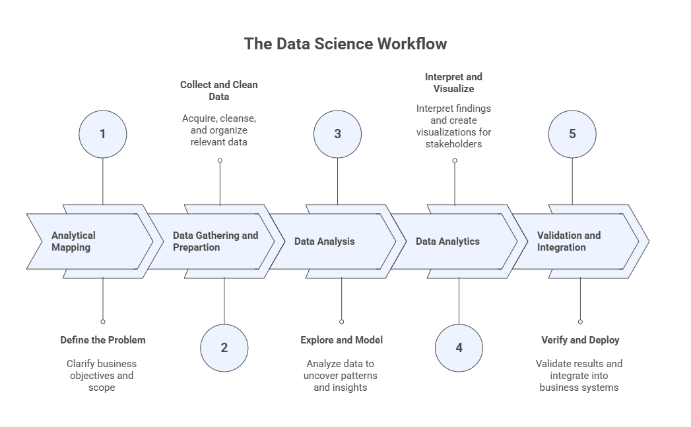
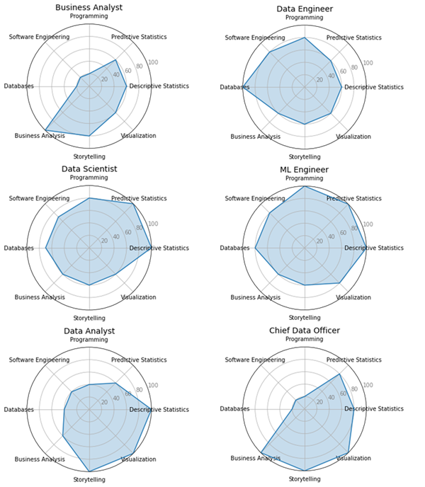
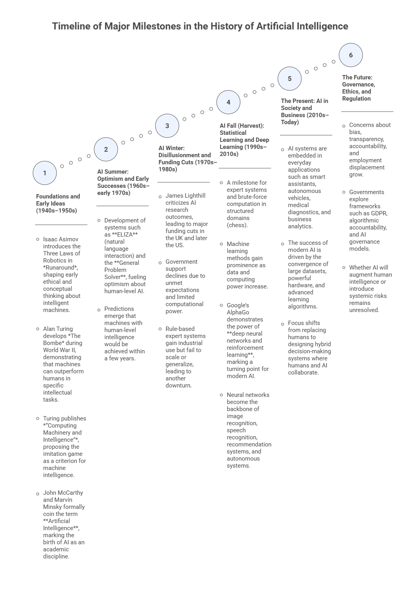

# 1 — Introduction to EDA: History, Concepts, Analytical Process Flow, and GenAI Foundations

**Exploratory Data Analysis (EDA)** is the foundation for any data-driven solution, whether the goal is insight generation, decision support, or automation. This opening module introduces the historical, conceptual, and analytical context of EDA, situating it within the broader data science and artificial intelligence ecosystem. 

Students will explore how data analysis evolved alongside advances in computation and AI, where EDA fits in the analytical workflow, and why understanding data through descriptive analysis and visualization is a prerequisite for effective modeling, storytelling, and dashboard design. The module also establishes how Generative AI can be used responsibly as a co-pilot in exploratory analysis, supporting, but never replacing, statistical reasoning, visualization literacy, and human judgment.

## Learning Objectives

By the end of this module, students should be able to:

1. Explain what EDA is and distinguish it from related concepts such as data analytics, data mining, and machine learning. 
2. Describe the **data science / analytics workflow** as an end-to-end process and locate where EDA fits.  
3. Identify common **careers/roles** in data science and connect them to core knowledge/skills.   
4. Summarize major milestones in the history of AI and explain why **data availability + compute + algorithms** change what is possible.   
5. Explain at a high level what **prompt engineering**, **context engineering**, **foundational models**, and **GenAI ecosystems** mean in the context of doing EDA.   

## 1.1 What EDA Is (and Is Not)
Exploratory Data Analysis (EDA) encompasses a broad set of techniques focused on manipulating, summarizing, and visualizing data without performing formal modeling or statistical inference. 
The primary purpose of EDA is to develop a deep understanding of the data itself, its structure, behavior, and key patterns, by means of descriptive operations and visual representations. 
As the initial phase of the analytical workflow, EDA plays a critical role in shaping subsequent decisions related to modeling, inference, and advanced analytics, often determining which methods are appropriate and which variables are most informative.

In essence, the main objectives of EDA are to:

- Understand the overall structure and distribution of the data.
- Summarize the main characteristics of variables using descriptive measures.
- Extract meaningful insights and indicators from raw data.
- Assess variable relevance and support feature selection.
- Explore and visualize relationships among variables.
- Detect anomalies, outliers, or unusual patterns.
- Prepare the data for the application or selection of learning-based methods.

## 1.2 The Data Science Workflow and Where EDA Fits
EDA sits in the portion of the workflow where we **explore, summarize, clean, and visualize** data to understand it before building downstream solutions. The course program explicitly positions AEDA before specialized analytics.  
The book reinforces that EDA becomes critical for making data suitable for modeling and for transforming raw data into insights that can inform AI solutions. 



## 1.3 Careers in Data Science: roles & responsibilities (high-level)
Examples of roles discussed include: **Business Analyst, Data Scientist, Data Analyst, Data Engineer**, and related leadership/architecture roles.   
One useful framing is:  
- Data Scientist: identifies suitable data, designs/applies algorithms, analyzes results, and bridges business ↔ analytics. 
- Data Analyst: extracts data, applies tools for insights/visualization/KPIs, consolidates into reports/dashboards. 
- Data Engineer: manages ETL (extract-transform-load), pipelines, and transformations that enable analysis.  



## 1.4 A Brief History of AI (why it belongs in an EDA course)
A brief history of Artificial Intelligence is essential in an Advanced Exploratory Data Analysis (AEDA) course because the evolution of AI is tightly coupled with the availability, quality, and understanding of data. Many of the early successes and failures of AI can be traced not only to algorithmic limitations, but also to insufficient data, inadequate data preparation, and poor understanding of data structure and variability. Modern AI breakthroughs—particularly those based on statistical learning and deep learning—became possible only when large volumes of data could be collected, explored, cleaned, summarized, and visualized effectively. AEDA provides the analytical foundation that enables these advances by revealing patterns, distributions, relationships, and anomalies in data, guiding appropriate model selection and interpretation. Understanding the historical trajectory of AI helps students recognize why exploratory analysis is a prerequisite for reliable, ethical, and effective AI systems, rather than a secondary or optional step in the analytical workflow.



## 1.5 GenAI Foundations

Generative AI (GenAI) is rapidly transforming the way analysts, researchers, and professionals work with data.
From writing code and interpreting results to summarizing reports and suggesting visualizations, **large language models (LLMs)** have become powerful collaborators in the data analysis workflow.

But to get meaningful results from these tools, you need more than access, you need **strategy**.
This section introduces the foundational skills for communicating effectively with GenAI systems in data analysis contexts:
the anatomy of a prompt; common prompt patterns; reverse prompting; meta-prompting; and AI workspaces.

No prior AI knowledge is required. If you have ever asked a question and received an unhelpful answer, you already understand the core problem this section solves.

### Part 1 — Anatomy of a Prompt

A **prompt** is any input you send to a GenAI model, for example, a question, an instruction, a dataset excerpt, or a combination of all three.
The quality of what you receive back depends on the quality of what you send.

Think of it like a search engine, but smarter and more conversational: vague inputs yield vague outputs; specific, well-structured inputs yield specific, useful outputs.

**The Four Components of a Prompt**

A well-crafted prompt for data analysis typically contains up to four components:

| Component | Purpose | Data Analysis Example |
|:--|:--|:--|
| **Instruction** | What you want the model to do | *"Identify any outliers in the sales data below."* |
| **Context** *(optional)* | Background framing or role assignment | *"You are a data analyst working for a retail company."* |
| **Input Data** | The content the model will work with | *A pasted table, CSV snippet, or summary statistics* |
| **Output Format** *(optional)* | Structure or style for the response | *"Respond in bullet points with one sentence of explanation per finding."* |

Not every prompt needs all four, but adding each component generally improves the response, especially for complex analytical tasks.

**Example: From Vague to Structured**

_Weak prompt:_
```
Analyze my sales data.
```

_Structured prompt:_
```
You are a business analyst preparing a monthly performance report.

Below is a summary table of regional sales figures for Q1 2025.
Analyze this data and identify the two highest-performing and two lowest-performing regions.
For each, provide a one-sentence explanation of a plausible business driver.

| Region       | Jan Sales ($) | Feb Sales ($) | Mar Sales ($) |
|--------------|---------------|---------------|---------------|
| Northeast    | 142,000       | 138,500       | 151,200       |
| Southeast    | 98,300        | 104,100       | 99,800        |
| Midwest      | 175,400       | 180,200       | 168,900       |
| West         | 210,100       | 198,400       | 225,600       |
| Southwest    | 67,800        | 71,200        | 65,400        |

Format: Two sections ("Top Performers" and "Underperformers") each with two bullet points.
```

The second prompt specifies *who* the AI is, *what* the data is, *what task* to perform, and *how* to format the output.
Each layer reduces ambiguity and focuses the model's response.

### Exercise 1: Deconstruct a Prompt

Read the prompt below and identify its four components (Instruction, Context, Input Data, Output Format).
Note which components are present and which are missing.

```
Summarize the key trends in the dataset below. Focus on year-over-year changes.

Year | Revenue ($M) | Expenses ($M) | Net Profit ($M)
2021 |     45.2     |     38.1      |      7.1
2022 |     51.8     |     42.6      |      9.2
2023 |     48.3     |     44.0      |      4.3
2024 |     60.1     |     47.5      |     12.6
```

After identifying the components, **rewrite this prompt** to include all four, tailored to the perspective of a financial analyst preparing a board presentation.

### Part 2 — Prompt Patterns

A **prompt pattern** is a reusable structure for communicating a particular kind of task.
Just as data analysts use established techniques (feature scaling, filtering, visualization) for specific problems, prompt patterns provide proven templates for specific AI tasks.

Understanding patterns helps you choose the right approach, avoid common mistakes, and get consistent, high-quality results.

**Instructional Prompts**

The most direct pattern: tell the model exactly what to do.

```
Calculate the percentage change in revenue between each consecutive year in the table below
and flag any year with a decline.

Year | Revenue ($M)
2021 | 45.2
2022 | 51.8
2023 | 48.3
2024 | 60.1
```

**Best for:** Single-step, clearly defined tasks, such as cleaning data, computing statistics, formatting outputs.

**Role-Based Prompts**

Assign the AI a professional identity or a certain persona. This shapes its tone, vocabulary, depth of explanation, and the lens through which it interprets your request.

```
You are a senior data scientist presenting findings to a non-technical executive audience.
Explain what a p-value means and when a result should be considered statistically significant.
Use plain language and one concrete analogy.
```

**Best for:** Adjusting the level and tone of explanations; simulating a specialist perspective on your data.

**Chain-of-Thought Prompts**

Ask the model to show its reasoning step by step before delivering a conclusion.
This is especially valuable in data analysis, where intermediate steps reveal whether the logic is sound.

```
A dataset has 1,200 rows. After removing duplicates, 1,080 remain.
After filtering for customers in the 18–35 age bracket, 432 remain.
Of those, 108 made a purchase in the last 30 days.

Step by step, calculate:
1. The percentage of rows removed as duplicates.
2. The percentage of unique customers in the 18–35 age bracket.
3. The conversion rate (purchases in last 30 days) among that age bracket.

Show each calculation before giving the final numbers.
```

**Best for:** Multi-step computations, logical reasoning tasks, debugging analytical workflows.

**Zero-Shot Prompts**

Provide only the instruction and data; no examples of the desired output.
Works well when the task is clear and standard.

```
Classify each of the following customer feedback entries as Positive, Neutral, or Negative.

1. "Delivery was fast and the product exceeded my expectations."
2. "It arrived on time, nothing special."
3. "Terrible quality. Broke on the first day."
4. "The packaging was nice but the item was missing."
```

**Best for:** Quick, well-defined tasks where the expected format is obvious.

**Few-Shot Prompts**

Provide one or more input-output examples before your actual request.
This teaches the model the exact format and logic you want, without retraining it.

```
Classify each transaction as "High Risk", "Medium Risk", or "Low Risk" based on amount and frequency.

Examples:
Transaction: $12,500 | 3 times in 24 hours → High Risk
Transaction: $850 | once per week → Low Risk
Transaction: $3,200 | twice in 3 days → Medium Risk

Now classify:
Transaction: $9,800 | 2 times in 48 hours →
Transaction: $420 | once per month →
Transaction: $5,100 | 4 times in 1 week →
```

**Best for:** Custom classification schemes, domain-specific labeling, non-standard output formats.

**Pattern Comparison at a Glance**

| Pattern | When to Use | Data Analysis Example Task |
|:--|:--|:--|
| **Instructional** | Clear, single-step task | "Compute the median and IQR for each column." |
| **Role-Based** | Needs expert tone or perspective | "As a statistician, interpret this regression output." |
| **Chain-of-Thought** | Complex reasoning or multi-step logic | "Show each step to calculate churn rate from this table." |
| **Zero-Shot** | Fast, obvious tasks | "Label these data points as anomalies or normal." |
| **Few-Shot** | Custom structure or classification scheme | "Follow these examples to tag sentiment in survey responses." |

:::{note}
A single prompt can combine multiple patterns. A role-based chain-of-thought prompt, for example, assigns an expert persona *and* requests step-by-step reasoning. It is often more effective than either alone.
:::

### Exercise 2: Prompt Pattern Practice

The following task can be approached with different prompt patterns.
Write one version of the prompt using **three different patterns** and compare the outputs you receive.

**Task:** You have a dataset of monthly website traffic and conversion rates over 12 months.
You want the AI to help you identify what is driving changes in the conversion rate.

### Part 3 — Reverse Prompting

**Reverse prompting** is an analytical technique where you start from an *output* and work backwards to reconstruct the prompt that likely generated it.

Instead of asking: *"What should I prompt to get a good analysis?"*
you ask: *"Given this output, what must have been asked?"*

This might seem like a curiosity, but it is a genuinely useful skill in data analysis contexts:

- You receive an AI-generated report and need to reproduce or adapt it.
- You want to understand *why* the model emphasized certain findings.
- You are teaching others how to prompt effectively.
- You want to audit an output for assumptions embedded in the original prompt.

**How to Do It**

The simplest method is to read the output carefully and ask:

- What **task** does this output appear to be performing? (Summarizing? Classifying? Recommending?)
- What **role or perspective** does the tone suggest?
- What **constraints or format** requirements are visible in the structure?
- What **data** must have been provided?

From those observations, reconstruct one or more candidate prompts.

**Example**

_AI-Generated Output:_
```
Key Findings — Customer Churn Analysis (Q3 2025):

• The Southeast region showed the highest churn rate at 18.4%, nearly double the company average.
• Customers on monthly billing plans churned at 3× the rate of annual subscribers.
• Churn increased sharply among users who had not logged in for more than 14 days.

Recommendation: Prioritize re-engagement campaigns targeting monthly-plan users in the Southeast who have been inactive for 2+ weeks.
```

_Reconstructed Prompt (candidate):_
```
You are a customer analytics consultant. Review the Q3 2025 churn data below and identify
the top three patterns driving customer attrition. For each pattern, note the affected segment
and the magnitude of the effect. Conclude with one actionable recommendation.
```

Notice what this reconstruction reveals: the output's structure (three bullet findings + one recommendation) directly reflects the prompt's instructions. The regional and billing breakdowns suggest the data provided had those dimensions.

### Exercise 3: Reverse Prompting Practice

Below is an AI-generated data analysis output. Your task is to work backwards and reconstruct the prompt.

**AI Output:**
```
Summary — Product Return Analysis:

1. Electronics had the highest return rate at 22%, followed by Apparel at 15%.
2. Returns peaked in January and August, coinciding with post-holiday and back-to-school seasons.
3. The most common return reason across all categories was "Item not as described" (41% of returns).

Suggested Action: Improve product descriptions and images for the top-returned SKUs, and
consider proactive customer outreach during peak return months.
```

**Your Tasks:**
- Propose **two different prompts** that could plausibly have generated this output.
- For each, explain what phrasing choices would likely shape the response differently.
- Then, use the meta-prompt template in Part 4 to have the AI perform the same task and compare results.

### Part 4 — Meta-Prompting

**Meta-prompting** means using an LLM to help you *design better prompts*, rather than jumping straight to the analytical task.

Instead of asking the AI to analyze your data, you first ask it:
*"Help me write the best prompt to analyze this data."*

This is especially powerful when:
- You are working with an unfamiliar dataset or domain.
- The task is complex and you are not sure how to structure the request.
- You want to generate multiple prompt variations to compare.
- You want to adapt a prompt from one context (e.g., marketing) to another (e.g., supply chain).

**The General Meta-Prompt Template for Data Analysis**

```
I need to prompt an AI model to perform the following data analysis task:

[DESCRIBE YOUR TASK IN PLAIN LANGUAGE]

The dataset contains: [DESCRIBE THE DATA — fields, format, size, domain]
The audience for the output is: [WHO WILL READ THE RESULTS]
The desired output format is: [BULLET POINTS / TABLE / PARAGRAPH / CODE / OTHER]

Please generate two or three effective prompt options I could use for this task.
For each, explain what it does well and what tradeoffs it involves.
```

**Example: Meta-Prompting for a Sales Analysis Task**

_Your plain-language description:_
> I have monthly sales data by region and product category for 2023–2024.
> I want the AI to identify which combinations of region and category are underperforming
> and suggest possible explanations. The output is for a regional sales manager.

_Meta-prompt you send:_
```
I need to prompt an AI model to perform the following data analysis task:

Identify underperforming region–product combinations in a 2-year sales dataset
and suggest possible explanations for a regional sales manager.

The dataset contains: monthly sales figures segmented by region (5 regions)
and product category (8 categories), covering 2023 and 2024.
The audience is a regional sales manager who understands the business but not statistics.
The desired output format is a brief table followed by a short paragraph of interpretation.

Please generate two or three effective prompt options I could use for this task.
For each, explain what it does well and what tradeoffs it involves.
```

The AI will return ready-to-use prompt options, calibrated to your data, audience, and format — saving you the trial-and-error of drafting from scratch.

### Meta-Prompting vs. Reverse Prompting

These two techniques are complementary:

| Technique | Direction | Use Case |
|:--|:--|:--|
| **Reverse Prompting** | Output → Prompt | Decode, audit, or reproduce an existing AI output |
| **Meta-Prompting** | Task → Prompt | Design an effective prompt before you start |

Use **reverse prompting** to learn from outputs you already have.
Use **meta-prompting** to get a head start on tasks you are about to run.

### Exercise 4: Meta-Prompting in Practice

You have a dataset of employee survey responses (1–5 Likert scale) across five dimensions:
Job Satisfaction, Work-Life Balance, Communication, Career Growth, and Team Collaboration.
You want to identify which departments have the most critical gaps and what to prioritize.

1. Write a plain-language description of your analysis task.
2. Use the meta-prompt template above to ask the AI to generate two prompt options for you.
3. Run both prompts on a small sample of fabricated or real data.
4. Evaluate: which prompt produced more actionable, audience-appropriate output?

### Part 5 — AI Workspaces for Data Analysis

Individual prompts are powerful, but most real data analysis projects are not single-question tasks.
They involve multiple datasets, iterative questions, evolving hypotheses, and output that needs to be organized and revisited.

**AI Workspaces**, known as *Projects* in platforms like Claude and ChatGPT, and *Spaces* in Perplexity, are persistent, structured environments where you can:

- Upload and store **reference documents, datasets, and reports**.
- Maintain a **shared context** across multiple conversations.
- Organize your prompts, outputs, and notes in one place.
- Collaborate with team members around a common knowledge base.

Think of the difference this way: a single prompt is a question you shout into a room. A workspace is a well-organized office where the AI already knows your project, your data, your context, and your goals.

**What You Can Do in an AI Workspace**

| Capability | What It Means for Data Analysis |
|:--|:--|
| **Upload project files** | Load datasets, codebooks, previous reports, and reference literature |
| **Persistent context** | The AI remembers your data and goals across sessions |
| **Grounded responses** | Answers draw on your files, reducing hallucination |
| **Organized conversations** | Separate threads for EDA, modeling, reporting, etc. |
| **Team collaboration** | Multiple analysts can contribute to the same workspace |

**Workspace Setup for a Data Analysis Project**

A well-configured workspace typically includes:

1. **Project Brief** — A plain-language document describing the business question, data sources, and success criteria.
2. **Data Dictionary** — Descriptions of every field in your dataset (type, range, meaning).
3. **Reference Materials** — Domain literature, previous analyses, or benchmark reports.
4. **Working Notes** — Evolving observations, hypotheses, and decisions made during analysis.

With these in place, every prompt you write in the workspace benefits from the full context of your project — without you having to repeat it each time.

**Grounded vs. Generic Responses: A Classroom Demonstration**

One of the most instructive things you can do with a workspace is compare two types of response to the same question:

_Generic chat (no workspace context):_
> *"What could explain a sudden drop in conversion rate?"*

The AI will give a generic list of possible causes — useful, but not specific to your data.

_Workspace-grounded response (with uploaded data and project brief):_
> *"What could explain the conversion rate drop we see between August and September in our e-commerce dataset?"*

The AI now draws on your actual data, your business context, and any notes you have added — producing a response that is directly actionable for your specific situation.

This contrast captures the core value of context engineering: **the same model, dramatically different output, purely because of what surrounds the prompt**.

### Platforms at a Glance

| Platform | Workspace Feature | Best For |
|:--|:--|:--|
| **Claude (Anthropic)** | Projects | Document-heavy analysis; multi-session workflows |
| **ChatGPT (OpenAI)** | Projects | Broad analytical tasks; code execution with data uploads |
| **Perplexity** | Spaces | Research-intensive work; source-grounded summaries |
| **Google Gemini** | NotebookLM / AI Studio | Academic and research document analysis |
| **Microsoft Copilot** | Copilot Pages | Integration with Excel, Word, and Teams workflows |

### Exercise 5: Building an Analysis Workspace

Using any platform of your choice (Claude, ChatGPT, Perplexity, etc.):

1. **Create a new workspace / project** for a data analysis scenario of your choosing (e.g., customer churn, sales performance, survey analysis).
2. **Upload or paste** at least two context documents: a project brief and a data dictionary (you can fabricate these for practice).
3. **Run three prompts** that progressively build on each other:
   - Prompt 1: Exploratory — ask for an overview of patterns in the data.
   - Prompt 2: Diagnostic — ask for explanations of one specific finding.
   - Prompt 3: Prescriptive — ask for a recommended action based on the analysis.
4. **Compare**: run the same three prompts in a fresh chat with no workspace context.
5. Reflect: *How did the workspace change the specificity, accuracy, and usefulness of the responses?*

### Putting It All Together

The five concepts in this section form a layered toolkit for working with GenAI in data analysis:

- Anatomy of a Prompt   →   Know what goes into an effective instruction
- Prompt Patterns        →   Choose the right structure for your task
- Reverse Prompting      →   Learn from and audit AI-generated outputs
- Meta-Prompting         →   Co-design better prompts with AI's help
- AI Workspaces          →   Sustain complex, multi-session analysis projects

None of these require technical expertise. They require **intentional communication**, the same skill that makes a good research question, a clear brief, or a well-structured report.
GenAI tools amplify your analytical ability in direct proportion to how precisely you can express what you need.

## 1.6 Reflection

Understanding the historical evolution of Artificial Intelligence provides important perspective for students of Advanced Exploratory Data Analysis. Many of the successes and failures in AI history were driven not only by algorithmic limitations, but also by constraints related to data availability, data quality, computational power, and analytical understanding. Reflecting on this history reinforces a central message of this course: reliable insights and effective AI systems depend on rigorous exploratory analysis. As you progress through AEDA, consider how descriptive statistics, visualization, and data characterization shape modeling decisions, expose hidden assumptions, and support ethical and responsible use of AI. Also reflect on the role of Generative AI as an analytical co-pilot—powerful when guided by sound data reasoning, but limited without proper context and human judgment.

## Further Reading

Students wishing to deepen their understanding of the topics introduced in this module are encouraged to consult the references listed in the course syllabus bibliography, including:

- **De Castro, L. N. (2026).** *Exploratory Data Analysis: Descriptive Analysis, Visualization, and Dashboard Design*. CRC Press.  
- **Triola, M. F. (2017).** *Elementary Statistics* (13th ed.). Pearson.  
- **Knaflic, C. N. (2015).** *Storytelling with Data: A Data Visualization Guide for Business Professionals*. Wiley.  
- **Ward, M., Grinstein, G. G., & Keim, D. (2015).** *Interactive Data Visualization: Foundations, Techniques, and Applications* (2nd ed.). CRC Press.  
- **Wilke, C. O. (2019).** *Fundamentals of Data Visualization*. O’Reilly Media.
- Prompt Engineering Guide: [https://www.promptingguide.ai/](https://www.promptingguide.ai/)
- OpenAI Platform Prompt Engineering Guide: [https://platform.openai.com/docs/guides/prompt-engineering](https://platform.openai.com/docs/guides/prompt-engineering)
- **White, J. et al. (2023).** *A Prompt Pattern Catalog to Enhance Prompt Engineering.* arXiv:2302.11382.
- **Zhou, Y. et al. (2023).** *Large Language Models Are Human-Level Prompt Engineers.* arXiv:2211.01910.

These readings provide complementary perspectives on exploratory data analysis, visualization principles, data storytelling, prompt engineering, and the analytical foundations that support modern data science and artificial intelligence.
