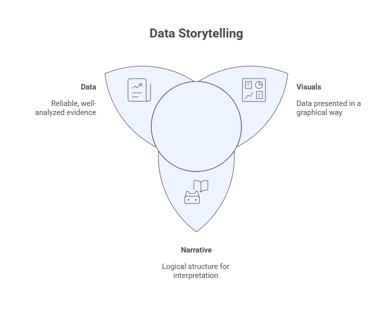
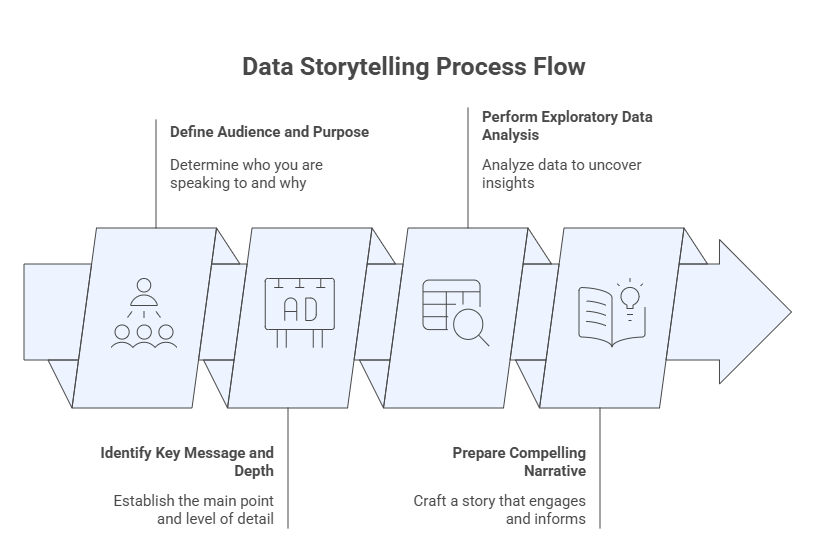
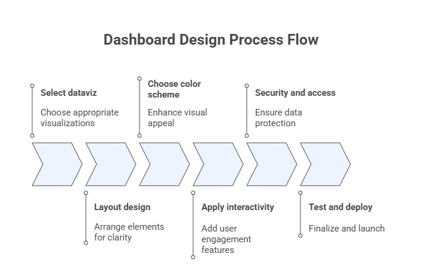
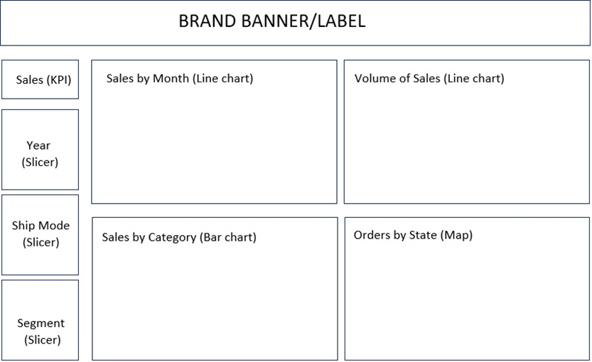
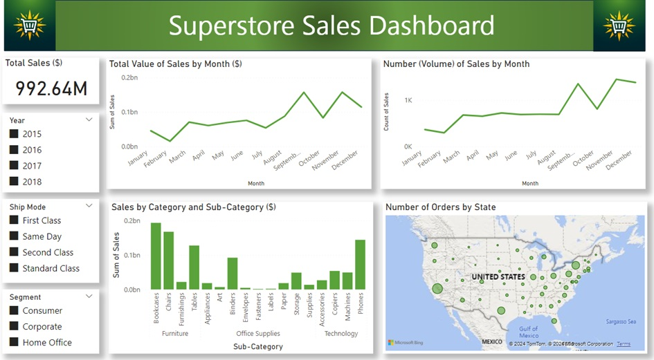

# 7 — Data Storytelling and Dashboard Design

This module integrates **exploratory data analysis, visualization principles, and communication** to transform analytical results into meaningful insights for decision-making. Data storytelling focuses on crafting a coherent narrative grounded in evidence, while dashboard design emphasizes interactive, visual summaries that support monitoring, exploration, and action.

Together, these components represent the culmination of Exploratory Data Analysis (EDA): moving from data understanding to **insight communication and decision support**.

## Learning Objectives

By the end of this module, students will be able to:

1. Define audience, purpose, and context for data-driven communication.
2. Identify key analytical messages and appropriate levels of detail.
3. Structure data stories that combine narrative, evidence, and visualization.
4. Design dashboards that align visual encodings, layout, and interaction with analytical goals.
5. Apply best practices for usability, accessibility, and security in dashboards.
6. Develop an end-to-end data storytelling and dashboard solution using a real dataset.

## 7.1 Data Storytelling

**Data storytelling** is the practice of communicating insights derived from data through a structured narrative supported by appropriate visualizations. It combines three core elements:

* **Data**: reliable, well-analyzed evidence.
* **Narrative**: a logical structure that guides interpretation.
* **Visualization**: visual encodings that reduce cognitive load and emphasize meaning.

Effective data storytelling does not aim to show *everything* in the data, but rather to highlight what matters for a given audience and purpose.

<p>
**Figure:** Relationship among data, narrative and visuals for the storytelling design process.

### 7.1.1 Define the Audience and Purpose

The first step in data storytelling is to clearly define:

* **Audience**: executives, managers, analysts, domain experts, or the general public.
* **Purpose**: inform, explain, persuade, monitor, or support decision-making.

Audience characteristics determine:

* Level of technical detail
* Choice of metrics and visualizations
* Language, tone, and framing

A visualization that works for analysts may overwhelm decision-makers; conversely, oversimplification can obscure critical nuance for technical audiences.

 <p>
**Figure:** Data storytelling process flow.

### 7.1.2 Identify the Key Message and Depth

A data story should revolve around a **small number of key messages** derived from exploratory analysis.

Key questions include:

* What is the most important insight?
* What evidence supports it?
* How much detail is necessary for this audience?

Depth should be adjusted by layering information:

* High-level summary for quick understanding
* Supporting views for deeper exploration
* Access to raw or detailed data when needed

### 7.1.3 Perform the Exploratory Data Analysis

Robust data storytelling is grounded in **rigorous exploratory data analysis**. Prior to narrative construction, the analyst should:

* Understand distributions, variability, and outliers
* Identify associations and trends
* Detect anomalies or unexpected patterns
* Validate data quality and assumptions

EDA ensures that the story is **evidence-based**, not anecdotal, and helps prevent misleading conclusions.

### 7.1.4 Prepare a Compelling Narrative

A compelling data narrative typically follows a logical structure, such as:

1. **Context**: why the problem matters
2. **Question**: what is being investigated
3. **Evidence**: key findings supported by data and visuals
4. **Insight**: interpretation of results
5. **Implications**: recommended actions or decisions

Narratives should be concise, focused, and aligned with the analytical goal. Visualizations should be integrated naturally into the story, reinforcing—rather than distracting from—the message.

The table below brings together the four core principles of storytelling design: defining the audience and purpose, identifying the central message and appropriate level of detail, conducting the exploratory data analysis, and crafting a compelling narrative. Once these elements are established, the analyst is prepared to proceed with the planning and design of the dashboard.

**Table:** Matrix with the four storytelling design principles.
| **Audience and Purpose** | **Exploratory Analysis** |
|--------------------------|--------------------------|
| • Specific group or individuals: demographics, interests, and knowledge level.<br>• Clarify the objectives through the narrative. | • What questions do you want to answer with the data?<br>• What kind of relationships exist in the data?<br>• What are the best techniques for displaying the variables and their relationships? |
| **Key Message and Depth** | **Compelling Narrative** |
| • Central theme or insight: clear, concise, and relevant.<br>• Depth: level of detail, context, and supporting data. | • Persuasive and impactful presentation.<br>• Guide the audience through the insights and information. |

## 7.2 Prompt Exercise: Building a Data Story with an LLM

In this exercise, you will use a Large Language Model (LLM) as a collaborative assistant to construct a complete data story for the **Superstore Sales dataset**, following the four-step storytelling design process introduced in this module. You will write, refine, and evaluate a sequence of prompts, one per storytelling step, and critically assess the quality of the LLM's responses.

The goal is not simply to get the LLM to produce output, but to learn how **prompt design choices** shape the depth, structure, and usefulness of that output.

### Background: The Superstore Dataset

The Superstore Sales dataset contains retail transaction records across the United States. Its 18 variables cover order logistics, customer segments, product categories and sub-categories, geographic attributes (city, state, region), and sales figures. Use this context in all your prompts — you do not need to upload the actual data file unless your LLM interface supports it.

### Part 1 — Step-by-Step Prompt Sequence

Work through each step in order. For each step, you will: **(a)** write your initial prompt, **(b)** record the LLM's response (summarized or quoted briefly), and **(c)** write a refined follow-up prompt if the first response was incomplete or misaligned.

#### Step 1 · Audience and Purpose

**Your task:** Prompt the LLM to define a specific audience and a clear analytical purpose for a data story about Superstore Sales.

**Starter prompt to adapt and improve:**
```
I am building a data story using the Superstore Sales dataset, which contains 18 variables covering orders, customers, products, geography, and sales values across the United States. Help me define an appropriate audience and purpose for this story. Be specific about who the audience is, what decisions they need to make, and what level of technical detail is appropriate.
```

**Guidance questions to help you refine your prompt:**
- Did the LLM produce a single, specific audience, or a vague generic one (e.g., "business stakeholders")?
- Did it connect the audience's role to the specific variables available in the dataset?
- If the output was too generic, add a constraint, for example, specify the audience role (sales manager, regional director, executive) or the decision context (quarterly review, product strategy meeting).

**Deliverable:** Save your best prompt and the LLM's response. Write 2–3 sentences evaluating how well the output aligns with the audience-and-purpose principle from the module.

#### Step 2 · Key Message and Depth

**Your task:** Prompt the LLM to identify one central insight and determine the appropriate level of analytical depth for the audience defined in Step 1.

**Starter prompt to adapt and improve:**
```
Based on the audience and purpose we defined, identify the single most important message that a data story about Superstore Sales should communicate. Then describe the appropriate level of depth: what high-level summary should be shown first, what supporting evidence is needed, and what detail can be omitted or placed in a secondary view?
```

**Guidance questions to help you refine your prompt:**
- Did the LLM commit to one central message, or produce a list of several equally weighted ones?
- Did it connect depth decisions to the audience (e.g., executives need high-level KPIs; analysts need breakdowns)?
- Try prompting the LLM to justify each depth decision with a reason tied to the audience's goals.

**Deliverable:** Save your best prompt and the LLM's response. Write 2–3 sentences evaluating whether the key message is focused and whether the depth layering is appropriate for the audience.

#### Step 3 · Exploratory Analysis Plan

**Your task:** Prompt the LLM to outline the exploratory analysis questions and variable relationships that would provide the evidence needed to support the key message.

**Starter prompt to adapt and improve:**
```
Now outline the exploratory data analysis that should be performed on the Superstore dataset to support the key message identified. For each analysis question, specify: (1) which variables are involved, (2) what type of relationship or pattern to look for, and (3) which visualization type would best display the result. Organize your response around the four EDA goals from the module: distributions, associations, trends, and anomalies.
```

**Guidance questions to help you refine your prompt:**
- Did the LLM stay grounded in the actual Superstore variables (e.g., Sales, Category, Region, Order Date), or did it invent variables not in the dataset?
- Did it suggest visualization types that are appropriate for the variable types involved (e.g., time series for Order Date vs. Sales, bar chart for Category vs. Sales)?
- If the LLM hallucinated variables, add an explicit list of available variables to your prompt.

**Deliverable:** Save your best prompt and the LLM's response. Identify one EDA suggestion you find well-grounded and one that you would revise or reject, explaining why.

#### Step 4 · Compelling Narrative

**Your task:** Prompt the LLM to write a complete data narrative following the five-part structure from the module: Context → Question → Evidence → Insight → Implications.

**Starter prompt to adapt and improve:**
```
Using the audience, key message, and exploratory analysis plan we have developed, write a data story narrative for the Superstore Sales dataset. Structure the narrative in five parts: (1) Context — why this analysis matters, (2) Question — what is being investigated, (3) Evidence — key findings with specific variable references, (4) Insight — what the evidence means, and (5) Implications — what actions or decisions should follow. Write for the audience we defined. Keep the narrative concise and avoid technical jargon.
```

**Guidance questions to help you refine your prompt:**
- Is the narrative logically sequenced, or does it jump between sections?
- Does the Evidence section reference specific patterns (e.g., particular categories, regions, or time periods) rather than vague generalizations?
- Is the tone and vocabulary appropriate for the defined audience?
- Try asking the LLM to revise a specific section that felt weak and observe how the output changes.

**Deliverable:** Save your best prompt and the LLM's final narrative. Annotate each of the five narrative sections directly in your submission (label them C, Q, E, I, Im).

### Part 2 — Critical Reflection

Answer the following questions individually, in your own words. Each response should be 3–5 sentences.

1. **Prompt precision:** How did your prompts change from your first attempt to your refined version in each step? What specific changes led to better outputs?

2. **Hallucination and grounding:** Did the LLM at any point introduce variables, statistics, or claims that are not present in or supported by the Superstore dataset? How did you detect and correct this?

3. **Narrative quality:** Compare the LLM's narrative (Step 4) against the five-part structure. Which section was strongest and which was weakest? What does this suggest about how LLMs handle storytelling versus analysis?

4. **Human vs. LLM roles:** Based on this exercise, which parts of the data storytelling process benefit most from LLM assistance, and which parts still require human judgment? Justify your answer using specific examples from your session.

5. **Ethical consideration:** If this LLM-generated story were presented to real decision-makers without disclosure that it was AI-assisted, what risks could arise? How does this connect to the module's discussion of evidence-based storytelling?

### Submission Requirements

Submit a single document containing:

- Your prompt-response record for all four steps (Parts 1a–1d), including your evaluation notes.
- Your Part 2 reflection responses.
- A one-paragraph **Summary Assessment**: overall, how effective was the LLM as a storytelling collaborator, and what would you do differently in a real project?

**Format:** Follow the course report template. Maximum length: 6 pages excluding cover page.

## 7.3 Dashboard Design

A **dashboard** is an interactive visual interface that consolidates key indicators, trends, and patterns into a single view. Dashboards are widely used for **monitoring performance, supporting decisions, crafting stories, and enabling exploratory analysis**.

Unlike static reports, dashboards emphasize:

* Interactivity
* Real-time or near–real-time updates
* User-driven exploration

The figure below summarizes the main steps  involved in the process of designing dashboards.


**Figure:** Dashboard design process flow.

### 7.3.1 Selecting Appropriate Visualizations

Visualization choices in dashboards should follow the same principles discussed in earlier modules:

* Match visualization type to data type and analytical goal
* Prefer simple, familiar charts for frequent monitoring
* Avoid unnecessary decoration or chart variety

Common dashboard elements include:

* KPIs and summary metrics
* Time series for trends
* Bar charts for comparisons
* Maps for spatial patterns

### 7.3.2 Designing the Dashboard Layout

Layout strongly influences usability and comprehension. Effective layouts:

* Follow a clear visual hierarchy (most important elements first)
* Use consistent alignment and spacing
* Group related elements logically
* Minimize scrolling when possible

A common strategy is a **top-down layout**, where high-level KPIs appear at the top and detailed views appear below.

### 7.3.3 Choosing a Color Scheme

Color should be used intentionally and sparingly. Good practices include:

* Use color to encode meaning, not decoration
* Maintain consistency across views
* Ensure sufficient contrast for readability
* Consider color-blind–safe palettes

Neutral colors are often preferable for backgrounds, while accent colors can highlight critical values, changes, or exceptions.

### 7.3.4 Applying Interactivity

Interactivity allows users to explore data dynamically. Common interactive features include:

* Filters and slicers
* Drill-down and drill-through actions
* Tooltips with additional context
* Linked views (brushing and highlighting)

Interactivity should enhance insight, not overwhelm the user. Each interactive element should have a clear purpose.

### 7.3.5 Security and Access Control

Dashboards often expose sensitive or strategic information. Key considerations include:

* Role-based access control
* Data anonymization when appropriate
* Secure authentication and authorization
* Compliance with organizational and legal requirements

Security should be addressed early in the design process, not as an afterthought.

### 7.3.6 Test and Iterate

Dashboard design is inherently iterative. Testing should involve:

* Real users from the target audience
* Representative tasks and scenarios
* Feedback on clarity, usability, and usefulness

Continuous iteration ensures that dashboards remain aligned with evolving data, goals, and user needs.

## 7.4 Prompt Exercise: Designing a Dashboard with an LLM

In this exercise, you will use a Large Language Model (LLM) as a collaborative design assistant to plan and specify a complete interactive dashboard for the **Superstore Sales dataset**, following the six-step dashboard design process introduced. You will write, refine, and evaluate a sequence of prompts, one per design step, and critically assess the quality and practical usefulness of the LLM's outputs.

The goal is not to have the LLM build a dashboard for you, but to use it to make **informed, justified design decisions** at every stage of the process, decisions you could hand to a developer or implement yourself in a BI tool such as Power BI, Tableau, or Python (Dash/Plotly).

### Background: The Superstore Dataset

The Superstore Sales dataset contains retail transaction records across the United States. Its 18 variables cover order logistics (Order Date, Ship Date, Ship Mode), customer attributes (Segment, Region, State), product classification (Category, Sub-Category, Product Name), and sales performance (Sales). Use this context in every prompt — the LLM should ground all design recommendations in the actual variables available.

### Part 1 — Step-by-Step Prompt Sequence

Work through each step in order. For each step, you will: **(a)** write your initial prompt, **(b)** record the LLM's response (summarized or quoted briefly), and **(c)** write a refined follow-up prompt if the first response was incomplete or misaligned with module principles.

#### Step 1 · Select Appropriate Visualizations

**Your task:** Prompt the LLM to recommend a set of visualization types for the dashboard, matched to the analytical questions and variables of the Superstore dataset.

**Starter prompt to adapt and improve:**
```
I am designing a dashboard for the Superstore Sales dataset, which has 18 variables including Order Date, Ship Date, Ship Mode, Customer Segment, Region, State, Category, Sub-Category, Product Name, and Sales. The intended audience is sales managers and business analysts who need to monitor sales performance and identify trends. Recommend a specific set of visualizations for the dashboard. For each one, state: (1) the chart type, (2) the variables it displays, (3) the analytical question it answers, and (4) why this chart type is appropriate for those variables.
```

**Guidance questions to help you refine your prompt:**
- Did the LLM recommend chart types that are appropriate for the variable types involved (e.g., line chart for Sales over Order Date, bar chart for Sales by Category)?
- Did it include a KPI element for high-level summary metrics, as shown in the module's case study?
- Did it avoid unnecessary or exotic chart types that would confuse the target audience?
- If any recommendation seems mismatched to the data type, push back by specifying the variable type (categorical, continuous, temporal) and ask for a revised recommendation.

**Deliverable:** Save your best prompt and the LLM's response. Write 2–3 sentences evaluating whether the visualization choices are appropriate, grounded in the available variables, and aligned with the audience's monitoring needs.

#### Step 2 · Design the Dashboard Layout

**Your task:** Prompt the LLM to produce a textual wireframe or layout specification that describes where each visualization will be positioned in the dashboard.

**Starter prompt to adapt and improve:**
```
Using the visualizations we selected, propose a layout for the dashboard. Describe where each element should be placed — top, left panel, center, bottom — and explain the reasoning behind each placement decision. The layout should follow a top-down visual hierarchy, placing the most important information first. Also describe how related elements should be grouped and how whitespace should be used to separate sections.
```

**Guidance questions to help you refine your prompt:**
- Did the LLM place the KPI at the top of the dashboard, consistent with the top-down hierarchy principle from the module?
- Did it group related charts logically (e.g., time-series views together, geographic view near regional breakdowns)?
- Did it address element sizing — giving larger panels to more complex or important charts?
- If the layout felt cluttered or unstructured, ask the LLM to produce a grid-based description (e.g., "3-column, 2-row grid") and assign each visualization to a cell.

**Deliverable:** Paste your best prompt and the LLM's layout description. Sketch or describe the wireframe in your submission based on the LLM's output, and annotate any placements you would change and why.

#### Step 3 · Choose a Color Scheme

**Your task:** Prompt the LLM to recommend a color scheme for the dashboard and justify each choice against the visualization principles from the module.

**Starter prompt to adapt and improve:**
```
Recommend a color scheme for the Superstore Sales dashboard. Specify: (1) a primary accent color for key metrics and highlights, (2) a neutral background color, (3) how categorical variables such as Category or Segment should be encoded with color, and (4) how to handle positive versus negative performance indicators if applicable. Justify each choice using principles of color in data visualization: contrast, consistency, meaning, and accessibility.
```

**Guidance questions to help you refine your prompt:**
- Did the LLM justify its color choices with a principle (e.g., contrast for readability, consistency across views, semantic meaning)?
- Did it address color-blind safety? If not, ask it to revise the palette to be accessible to users with deuteranopia (the most common form of color blindness).
- Did it recommend a consistent number of colors — avoiding rainbow palettes that encode no meaning?
- Compare the LLM's recommendation to the module's case study, which used shades of green for positive connotation and contrast on a light background. Does the LLM's palette follow similar reasoning?

**Deliverable:** Paste your best prompt and the LLM's response. Write 2–3 sentences evaluating whether the color scheme is principled, consistent, and accessible.

#### Step 4 · Apply Interactivity

**Your task:** Prompt the LLM to specify the interactive features of the dashboard, including filters, slicers, tooltips, and any linked views.

**Starter prompt to adapt and improve:**
```
Specify the interactive features that should be included in the Superstore Sales dashboard. For each interactive element, describe: (1) the type of interaction (filter, slicer, tooltip, drill-down, linked view), (2) which variables or visualizations it affects, (3) how the user would trigger it, and (4) what analytical benefit it provides to the audience. Prioritize interactions that allow the user to filter by time period, shipment mode, and customer segment.
```

**Guidance questions to help you refine your prompt:**
- Did the LLM include slicers for Year, Ship Mode, and Segment — the three filter dimensions highlighted in the module's case study?
- Did it include tooltips for each visualization, providing exact values on hover?
- Did it suggest any linked views (brushing and highlighting across charts), and if so, are those links analytically meaningful?
- If the LLM proposed too many interactive elements, ask it to rank them by priority and identify the minimum set needed for a first usable version.

**Deliverable:** Paste your best prompt and the LLM's response. Identify the two most valuable interactions recommended and explain why they support the audience's decision-making goals.

#### Step 5 · Security and Access Control

**Your task:** Prompt the LLM to outline the security and access considerations that would apply if this dashboard were deployed in a real organizational setting.

**Starter prompt to adapt and improve:**
```
The Superstore Sales dashboard will be deployed internally within a retail organization and shared with sales managers, regional directors, and executive leadership. Outline the security and access control considerations for this deployment. Address: (1) role-based access control — which user roles should see which data, (2) any data that should be anonymized or restricted, (3) authentication requirements, and (4) compliance considerations relevant to internal business data.
```

**Guidance questions to help you refine your prompt:**
- Did the LLM differentiate between user roles meaningfully (e.g., executives see aggregate views only; regional managers see only their own region's data)?
- Did it address authentication (login, SSO) and not just authorization (who can see what)?
- Did it treat security as a design-phase concern rather than an afterthought, consistent with the module's guidance?
- If the LLM gave only generic security advice, push it to apply each recommendation specifically to the Superstore dashboard structure you have designed.

**Deliverable:** Paste your best prompt and the LLM's response. Write 2–3 sentences evaluating whether the security plan is specific, role-differentiated, and aligned with the module's principle that security should be addressed early in design.

#### Step 6 · Test and Iterate

**Your task:** Prompt the LLM to design a user testing plan for the dashboard, specifying who should test it, what tasks they should perform, and what feedback to collect.

**Starter prompt to adapt and improve:**
```
Design a user testing plan for the Superstore Sales dashboard before it is deployed. Specify: (1) who the test participants should be and why, (2) three representative tasks a tester would perform using the dashboard, (3) the questions or criteria used to evaluate clarity, usability, and usefulness, and (4) how feedback would be used to iterate on the design. Align the testing plan with the intended audience of sales managers and business analysts.
```

**Guidance questions to help you refine your prompt:**
- Did the LLM select test participants that match the actual intended audience, rather than generic "users"?
- Are the three tasks realistic and specific (e.g., "Find the total sales for the West region in 2017 using the map and slicer") rather than vague (e.g., "Explore the dashboard")?
- Did it suggest both usability criteria (can the user complete the task?) and usefulness criteria (did the dashboard answer their question?)?
- Did it describe what happens after testing — specifically how feedback translates into design changes?

**Deliverable:** Paste your best prompt and the LLM's response. Write the three testing tasks in your own words and explain what aspect of the design each task is intended to validate.

### Part 2 — Critical Reflection

Answer the following questions individually, in your own words. Each response should be 3–5 sentences.

1. **Prompt precision:** Across the six steps, which step required the most prompt refinement to get a useful response? What specific changes to the prompt made the biggest difference?

2. **Design grounding:** At any point, did the LLM recommend visualizations, colors, or interactions that were not appropriate for the Superstore dataset's variables or the target audience? How did you identify and correct this?

3. **Completeness vs. quality:** Did the LLM tend to produce responses that were comprehensive but shallow, or focused and well-justified? How does this affect how you would use an LLM in a real dashboard design project?

4. **Human vs. LLM roles:** Which of the six design steps benefited most from LLM assistance, and which required the most human judgment to evaluate or override? Justify your answer with specific examples from your session.

5. **Ethical and practical considerations:** If a dashboard designed entirely through LLM prompts were deployed in a real business without human expert review, what risks could arise — in terms of design quality, security, or analytical accuracy? How should practitioners safeguard against these risks?

### Submission Requirements

Submit a single document containing:

- Your prompt-response record for all six steps (Steps 1–6), including evaluation notes.
- Your Part 2 reflection responses.
- A one-paragraph **Summary Assessment**: overall, how effective was the LLM as a dashboard design collaborator, and at which stage would you rely on it most versus least in a real project?

**Format:** Follow the course report template. Maximum length: 8 pages excluding cover page.

## 7.5 Case Study: Superstore Sales Dataset

This case study integrates **data storytelling and dashboard design** using the Superstore Sales dataset, a widely used benchmark in business analytics.

The dataset typically includes:

* Orders, customers, products, and categories
* Sales, profit, discounts, and quantities
* Temporal and geographic dimensions

### 7.5.1 Data Storytelling

The storytelling process begins by defining the business questions, such as:

* How are sales and profits evolving over time?
* Which regions and categories drive performance?
* Where are losses occurring?

Exploratory analysis is used to identify trends, patterns, and anomalies, which are then synthesized into a coherent narrative tailored to decision-makers.

### 7.5.2 Dashboard Design

The dashboard design phase translates the story into an interactive interface, typically including:

* High-level KPIs (total sales, profit, margin)
* Time series views for trends
* Comparative views by region, category, and segment
* Filters for time, geography, and product attributes

The final dashboard serves both as a **communication artifact** and a **decision-support tool**, allowing users to monitor performance and explore underlying drivers.

To illustrate, the wireframe presented in the figure below describes the layout to be used to build the dashboard.

 <p>
**Figure:** Wireframe with the dashboad layout for the Superstore Sales dataset.

The figure below shows the final dashboard built using PowerBI by Microsoft. 

 <p>
**Figure:** Dashboad for the Superstore Sales dataset created with PowerBI by Microsoft.

## Reflection

* Who is the intended audience for your data story, and how does this influence visualization and narrative choices?
* How do you balance simplicity and completeness when communicating insights?
* In what ways can interactivity strengthen—or weaken—a data story?
* How does dashboard design differ when the goal is monitoring versus exploration?
* What ethical or security considerations arise when sharing analytical dashboards?

## Further Reading

Students are encouraged to consult the bibliography listed in the course syllabus, particularly:

* **De Castro, L. N. (2026).** *Exploratory Data Analysis: Descriptive Analysis, Visualization, and Dashboard Design*. CRC Press.
* **Knaflic, C. N. (2015).** *Storytelling with Data: A Data Visualization Guide for Business Professionals*. Wiley.
* **Ward, M., Grinstein, G. G., & Keim, D. (2015).** *Interactive Data Visualization*. CRC Press.
* **Wilke, C. O. (2019).** *Fundamentals of Data Visualization*. O’Reilly Media.
